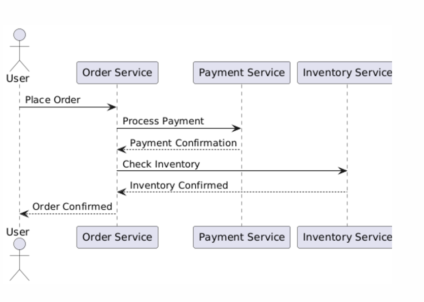
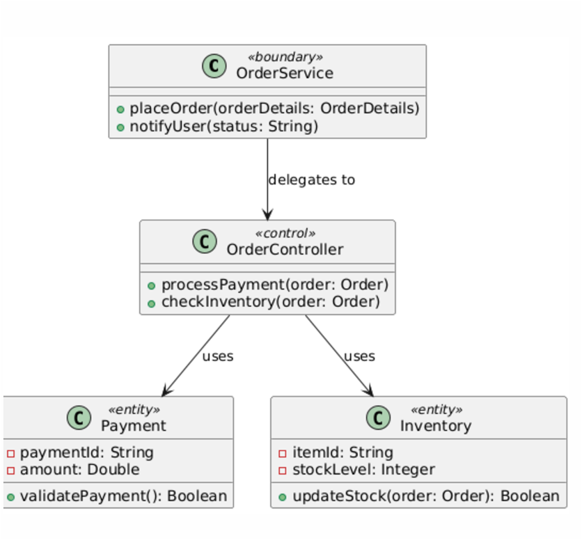

# Steps to Transition from Sequence Diagram to Class Diagram

## Step 1: Understand the Sequence Diagram
The sequence diagram provides a dynamic view of the system, showing how objects or components interact over time to achieve a goal. Here's how to approach it:

### Identify the Main Actor(s)
- **Definition:** External entities (users, systems, or devices) that initiate interaction.
- **Example:** The **User** initiates the interaction to place an order.

### Recognize the Participants
- **Definition:** Components or objects involved in the interaction, sending and receiving messages.
- **Examples:**
  - **Order Service:** Manages order-related processes.
  - **Payment Service:** Handles payment transactions.
  - **Inventory Service:** Checks stock availability.

### Understand the Flow of Messages
- **Definition:** Sequential actions between participants.
- **Examples:** 
  - Messages like `Place Order`, `Process Payment`, `Payment Confirmation` show the interaction flow.

---

## Step 2: Identify Classes
Translate participants into classes, categorizing them by role:

### Boundary Class
- **What it does:** Interfaces between the actor and the system.
- **Why it's important:** Captures input, sends responses, and delegates tasks.
- **Example:** **Order Service** acts as the boundary class for processing orders.

### Control Class
- **What it does:** Coordinates boundary and entity classes.
- **Why it's important:** Ensures tasks are processed in sequence.
- **Example:** **OrderController** manages payment and inventory interactions.

### Entity Class
- **What it does:** Represents business objects or data entities.
- **Why it's important:** Encapsulates data and business logic for modularity.
- **Examples:** 
  - **Payment** (for payment data).
  - **Inventory** (for stock management).

---

## Step 3: Analyze Relationships
Define the connections between identified classes based on the interactions in the sequence diagram:

### Delegation
- **Boundary to Control:** The boundary class (Order Service) delegates tasks to the control class (OrderController).

### Usage
- **Control to Entity:** The control class (OrderController) uses entity classes (Payment and Inventory) to complete tasks.
  - Example:
    - Validates payment using the **Payment** entity.
    - Checks stock via the **Inventory** entity.

### Multiplicity
- **Definition:** Defines how many instances of one class relate to another.
- **Example:** A single **OrderController** interacts with multiple **Payment** and **Inventory** objects.

---

## Step 4: Define Attributes and Methods
Assign responsibilities to each class:

### Boundary Class: **OrderService**
- **Responsibilities:** Handles user interactions.
- **Attributes:** None.
- **Methods:**
  - `placeOrder(orderDetails: OrderDetails)`: Captures order details.
  - `notifyUser(status: String)`: Sends order status to the user.

### Control Class: **OrderController**
- **Responsibilities:** Coordinates the order process.
- **Attributes:** None.
- **Methods:**
  - `processPayment(order: Order)`: Validates and processes payment.
  - `checkInventory(order: Order)`: Checks inventory availability.

### Entity Class: **Payment**
- **Responsibilities:** Manages payment data and logic.
- **Attributes:**
  - `paymentId: String`: Unique identifier.
  - `amount: Double`: Payment amount.
- **Methods:**
  - `validatePayment(): Boolean`: Validates payment details.

### Entity Class: **Inventory**
- **Responsibilities:** Manages stock data and updates.
- **Attributes:**
  - `itemId: String`: Unique identifier.
  - `stockLevel: Integer`: Quantity available.
- **Methods:**
  - `updateStock(order: Order): Boolean`: Updates stock after an order.

---

## Step 5: Draw the Class Diagram
Visualize the structure based on the classes and their relationships:

1. **Use Stereotypes:**
   - Label classes as <<boundary>>, <<control>>, <<entity>>.

2. **Include Attributes and Methods:**
   - Add details for each class.

3. **Define Relationships:**
   - **Association:** Solid lines for direct connections.
   - **Dependency:** Dashed lines for dependencies.

4. **Show Multiplicities:**
   - Use UML notation (e.g., `1..*`) for relationships.

---

## Step 6: Verify the Class Diagram
Ensure the class diagram is accurate and complete:

### Completeness
- All participants in the sequence diagram are represented as classes.
- All messages have corresponding methods in the class diagram.

### Generalization
- Classes like **OrderController** should handle all relevant tasks, not just specific instances.

### Consistency
- Relationships and interactions match the sequence diagram.

By following these steps, the class diagram will effectively represent the static structure derived from the dynamic interactions in the sequence diagram.
