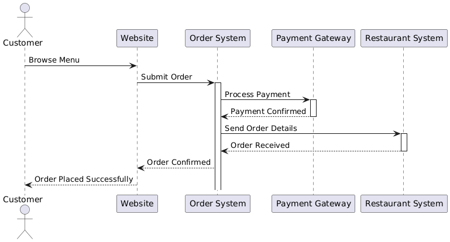
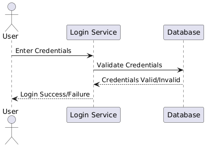
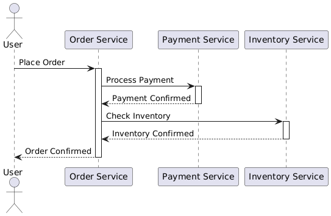
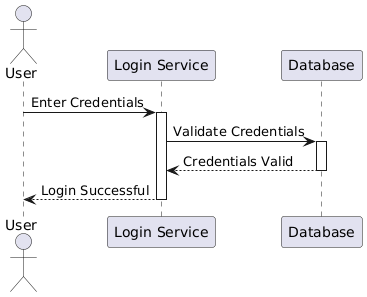

# Understanding Sequence Diagrams

A **Sequence Diagram** is a type of UML diagram that focuses on how objects interact over time. It visualizes the sequence of messages exchanged between objects to perform a specific function or process. Think of it as a timeline showing **who talks to whom** and in what **order**.

---

## 1. What is a Sequence Diagram?

Imagine you are ordering a pizza online:

1. **You visit the website** (you are the **actor**).
2. **You place an order** (you interact with the **order system**).
3. **The system processes the payment** (it interacts with the **payment gateway**).
4. **The system sends the order details to the restaurant** (interaction with the **restaurant system**).

A sequence diagram models this flow step-by-step, showing:

- **Actors**: Users or external systems initiating interactions.
- **Objects**: Internal components of the system interacting to achieve the goal.
- **Messages**: Actions or information exchanged between the actor and objects.

### In simple terms:
- **A state** is a condition or situation of the system at a specific point in time.
- **A transition** is a movement from one state to another, triggered by an event.

---

## 2. Why Use a Sequence Diagram?

Sequence diagrams are used to:

- **Model Dynamic Behavior**: Sequence diagrams show how different parts of a system work together to complete a task, helping you understand the dynamic flow of events.
  
- **Understand the Order of Interactions**: They provide a clear picture of what happens **first**, **next**, and **last**, which is crucial for understanding the order in which tasks or operations occur.

- **Visualize Responsibilities**: Sequence diagrams clarify which object or component is responsible for what action in the system, promoting better design and clearer accountability.

- **Facilitate Communication**: They help developers, designers, and stakeholders understand the workflow by showing the exact sequence of events in a clear and visual manner, improving collaboration and communication.

---

## 3. Components of a Sequence Diagram

Let’s break down the key elements of a sequence diagram:

### a. **Lifelines**
A **lifeline** represents an actor or object participating in the interaction. It is drawn as a vertical dashed line.

#### Example:
- **User**, **Order Service**, or **Payment Gateway** can all be lifelines in a sequence diagram, representing the different participants in the flow of messages.

### b. **Messages**
Messages represent communication between lifelines. These are drawn as horizontal arrows.

#### Types of Messages:
- **Synchronous Messages**: Represented by solid arrows with a filled arrowhead, indicating that the sender **waits for a response**.
  - Example: **Place Order**, **Process Payment**.
  
- **Asynchronous Messages**: Represented by solid arrows with an open arrowhead, indicating that the sender **does not wait** and continues without waiting for a response.
  - Example: **Send Email**, **Notify User**.

### c. **Activation Bars**
**Activation bars** show the time during which a lifeline is actively performing a task. These are drawn as a narrow vertical rectangle on a lifeline.

#### Example:
- If an **Order Service** is processing an order, it would have an activation bar indicating it is actively handling that task during that time.

### d. **Actors**
An **actor** is a person, device, or external system interacting with the system. Actors are represented by a stick figure.

#### Example:
- In an online shopping system, the **Customer** can be the actor interacting with the system.

### e. **Return Messages**
Return messages indicate the response sent back after processing a request. These are drawn as dashed arrows.

#### Example:
- After processing payment, the **Payment Service** sends a **Payment Confirmation** message back to the **Order Service**.

### f. **System Boundaries**
System boundaries show the boundary between the system and external actors or objects. This helps distinguish between internal components of the system and the external systems it interacts with.

---

## 4. How Does a Sequence Diagram Work?

Here’s a step-by-step explanation of how to create and understand a sequence diagram:

### Step 1: **Identify the Scenario**
Decide on the process or interaction you want to model.

#### Example:
- **Scenario**: A **user logging into a system**.

### Step 2: **Identify Actors and Objects**
Determine who is involved (actors) and what system components (objects) they interact with.

#### Example:
- **Actor**: User
- **Objects**: Login Service, Database

### Step 3: **Define Messages**
Identify the actions/messages exchanged between the actor and objects.

#### Example:
- **Enter Credentials** (User → Login Service)
- **Validate Credentials** (Login Service → Database)

### Step 4: **Draw Lifelines**
Draw a vertical dashed line for each actor and object.

### Step 5: **Add Messages**
Connect lifelines with arrows to represent messages being exchanged between them.

### Step 6: **Add Activation Bars**
Place activation bars on lifelines to show when an object is actively performing a task.

### Step 7: **Include Return Messages**
Add dashed arrows for responses sent back after processing a request, indicating the return flow of information.

---

## 5. A Simple Example: Online Order System

Let’s model an **Online Order System**:

### Actors and Objects:
- **Actor**: User
- **Objects**: 
  - **Order Service**
  - **Payment Service**
  - **Inventory Service**

### Messages:
- **Place Order** (User → Order Service)
- **Process Payment** (Order Service → Payment Service)
- **Check Inventory** (Order Service → Inventory Service)
- **Order Confirmed** (Order Service → User)

### Diagram Description:
1. The **User** initiates the process by sending a **Place Order** message to the **Order Service**.
2. The **Order Service** requests payment processing from the **Payment Service**.
3. Once payment is confirmed, the **Order Service** checks item availability with the **Inventory Service**.
4. If the item is available, the **Order Service** sends an **Order Confirmed** message back to the **User**.

---

## 6. Advanced Concepts in Sequence Diagrams

### a. **Boxes on Top of Sequence Diagrams**
The boxes on top of the diagram represent the objects involved in the sequence. These boxes can include:
- **States**: What state the object is in during the interaction.
- **Messages**: The communication flow.
- **Actors and Objects**.

### b. **Interaction with Class Diagrams**
In a class diagram, the boxes correspond to **classes** or **objects**, while the arrows (messages) correspond to **methods**.

### c. **Return Arrows**
Dashed arrows represent responses or results sent back after processing.

#### Example:
- A **Payment Confirmation** is sent from the **Payment Service** to the **Order Service** after the payment is processed.

---

## 7. Where are Sequence Diagrams Used?

### a. **Use in Software Design**
Sequence diagrams are great for modeling how different components of a system work together.

#### Example:
- Modeling the **login process** of a system, showing how the user, authentication service, and database interact.

### b. **Integration with Other Diagrams**
Sequence diagrams complement **use case diagrams**:
- **Use case diagrams** describe "what" happens (high-level functionality), while sequence diagrams describe "how" it happens (the detailed sequence of interactions).

### c. **Communication Across Teams**
These diagrams are useful for both **developers** and **non-technical stakeholders** to understand workflows and ensure everyone is aligned.

---

## 8. Advantages of Sequence Diagrams

- **Clear Visualization**: They show the exact order of interactions, making it easier to understand the flow of processes.
  
- **System Understanding**: Provide insights into the internal working of the system, helping to identify potential inefficiencies or issues.

- **Easy to Update**: Sequence diagrams can be modified easily as the system evolves, ensuring that the documentation stays current.

---

## 9. Limitations of Sequence Diagrams

- **Complexity**: For systems with many interactions, the diagram can become cluttered, making it difficult to read.

- **Focus on Specific Scenarios**: Sequence diagrams represent only one scenario at a time, so multiple diagrams might be required to represent different workflows or edge cases.

---

## 11. Summary

A **Sequence Diagram** models the time-based flow of interactions between objects and actors in a system. It provides a clear, step-by-step view of how a system executes a specific process. By breaking down the process into **lifelines**, **messages**, and **activation bars**, sequence diagrams help developers and stakeholders understand workflows clearly and efficiently.

### Key Takeaways:
- **Actors** and **Lifelines** represent who interacts with the system and what system components are involved.
- **Messages** and **Transitions** show how the system responds to events over time.
- **Return Messages** indicate the responses after processing tasks.
