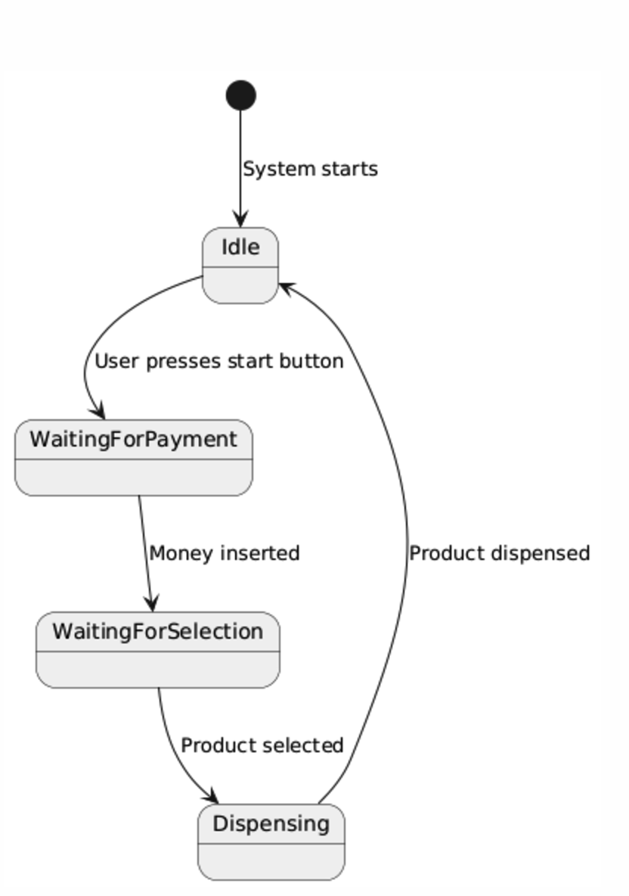
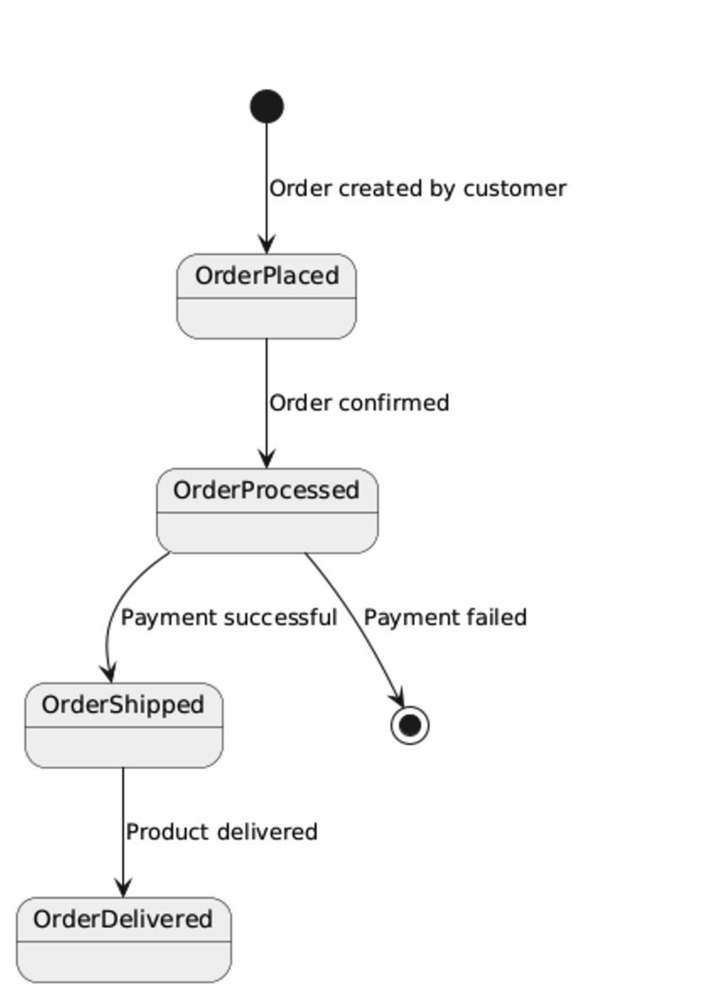
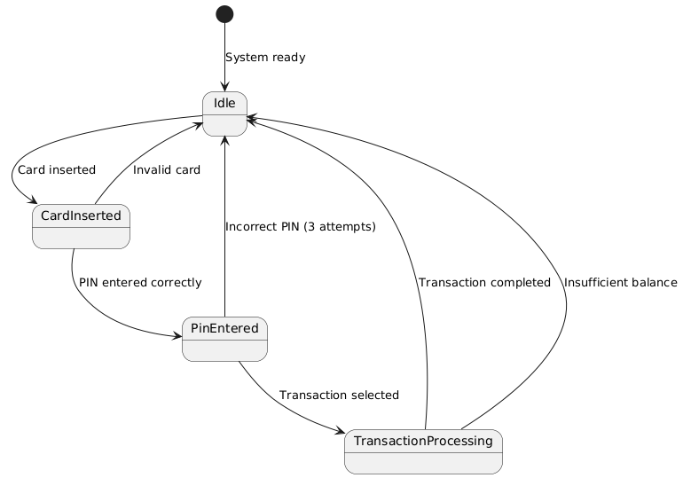

# Understanding State Transition Diagrams

A **State Transition Diagram** (or **State Machine Diagram**) is like a map of a system’s behavior over time, showing how it changes in response to events. Unlike use case diagrams, which focus on what the system does, state transition diagrams focus on **how** the system behaves under different conditions.

---

## 1. What is a State Transition Diagram?

Imagine a **vending machine**:

1. When you insert a coin, it switches from a **"waiting for payment"** state to a **"waiting for selection"** state.
2. After you press a button, it switches to a **"dispensing item"** state.
3. Finally, it returns to the **"waiting for payment"** state once the item is dispensed.

A state transition diagram visually represents this process, showing:

- The **states** the machine can be in.
- The **events** that trigger changes (transitions) between those states.

### In simple terms:
- **A state** is a condition or situation of the system at a specific point in time.
- **A transition** is a movement from one state to another, triggered by an event.

---

## 2. Why Use a State Transition Diagram?

State transition diagrams are used to:

- **Model Dynamic Behavior**: They show how a system evolves in response to external events, making it easier to understand the behavior of the system.
  
- **Clarify Complex Logic**: These diagrams help designers visualize the system’s logic, making it easier to document and communicate.

- **Ensure Completeness**: They help ensure that all possible states and transitions are accounted for, reducing the chance of missing important scenarios.

- **Aid Testing**: By showing all possible transitions, these diagrams identify edge cases, making sure that the system is robust and covers all scenarios.

---

## 3. Core Concepts of a State Transition Diagram

Let’s break down the key elements of a state transition diagram:

### a. **States** (What conditions can the system be in?)
A **state** represents a situation where the system is doing something or waiting to do something. States are typically shown as rounded rectangles.

#### Example:
- In an **ATM** system, states could include:
  - **Idle**: No user interaction, system waiting.
  - **Card Inserted**: A card has been inserted, and the ATM is waiting for the user to select an option.
  - **Processing Transaction**: The ATM is performing a transaction such as withdrawing money or checking balance.

### b. **Transitions** (What causes the system to move to another state?)
A **transition** is the movement from one state to another, triggered by an event. Transitions are represented as arrows between two states, often labeled with the event that causes the transition.

#### Example:
- In an **ATM**, inserting a card could trigger a transition from **Idle** to **Card Inserted**.

### c. **Events** (What triggers transitions?)
An **event** is an external action or input that causes a transition. 

#### Examples:
- Pressing a button
- Inserting money
- Completing a process

### d. **Initial State** (Where does the system start?)
The **initial state** is where the system begins when it’s first activated. This is represented as a solid black dot with an arrow pointing to the starting state.

#### Example:
- The **initial state** of an ATM could be **Idle**, where it waits for the user to insert a card.

### e. **Final State** (Where does the system end?)
The **final state** is where the system terminates or completes its task. This is shown as a black circle with a surrounding border.

#### Example:
- For an ATM, the **final state** might be when the **Transaction Complete** state is reached after a successful withdrawal or transaction.

### f. **Guards** (Conditions for transitions)
A **guard** is a condition that must be true for a transition to occur. Guards ensure that transitions only happen under certain conditions.

#### Example:
- An ATM only transitions from **Idle** to **Card Inserted** if a **valid card** is inserted.

### g. **Actions** (What happens during a transition?)
An **action** is something that occurs during the transition. Actions are typically associated with a state change.

#### Example:
- When a vending machine transitions from **Waiting for Selection** to **Dispensing Item**, it **dispenses the selected product**.

---

## 4. How Does a State Transition Diagram Work?

Here’s how a state transition diagram works step-by-step:

### Step 1: **Identify States**
Think about the different conditions or situations the system can be in.

#### Example:
For an online order system, states could include:
- **Order Placed**
- **Order Processed**
- **Order Shipped**
- **Order Delivered**

### Step 2: **Identify Transitions**
Determine the events that cause the system to move from one state to another.

#### Example:
- **Order Confirmed** transitions from **Order Placed** to **Order Processed**.

### Step 3: **Add Initial and Final States**
Decide where the system starts and where it finishes.

#### Example:
- An online order system might start with **Order Placed** and finish with **Order Delivered**.

### Step 4: **Add Guards and Actions**
Define any conditions (guards) or actions that occur during transitions.

#### Example:
- **Order Processed** transitions to **Order Shipped** only if **payment is successful**.

---

## 5. A Simple Example: Vending Machine

Let’s model a **vending machine**:

### States:
- **Idle**: Waiting for a user to interact.
- **Waiting for Payment**: Waiting for money to be inserted.
- **Waiting for Selection**: Waiting for the user to select a product.
- **Dispensing**: Dispensing the selected product.

### Transitions:
- From **Idle** to **Waiting for Payment**: Triggered by the event: User presses the start button.
- From **Waiting for Payment** to **Waiting for Selection**: Triggered by the event: Money inserted.
- From **Waiting for Selection** to **Dispensing**: Triggered by the event: Product selected.
- From **Dispensing** to **Idle**: Triggered by the event: Product dispensed.

### Guards:
- The transition from **Waiting for Payment** to **Waiting for Selection** occurs only if the **correct amount of money** is inserted.

### Diagram Description:
1. The vending machine starts in the **Idle** state.
2. A user presses the **start button**, moving it to **Waiting for Payment**.
3. The user inserts **money**, moving the machine to **Waiting for Selection**.
4. The user **selects a product**, moving the machine to **Dispensing**.
5. The product is dispensed, and the machine returns to **Idle**.

---

## 6. Practical Uses of State Transition Diagrams

### a. Understanding System Behavior
- Example: In an ATM, states like **Idle**, **Card Inserted**, and **Processing Transaction** help identify edge cases such as invalid cards or insufficient balance.

### b. Identifying Missing Scenarios
- State diagrams ensure no transitions or events are missed, ensuring the system is complete and robust.

### c. Communication
- These diagrams are easy for both technical and non-technical stakeholders to understand. This makes it easier to align everyone involved in the project.

### d. Improving System Design
- By visualizing how states interact, developers can identify areas where the design can be optimized or simplified.

---

## 7. Benefits of State Transition Diagrams

### Visual Clarity:
State transition diagrams make complex system behavior easy to understand by breaking it down into clearly defined states and transitions.

### Error Detection:
These diagrams highlight missing states, transitions, or invalid conditions that might otherwise go unnoticed.

### System Testing:
They help testers design test cases for all possible transitions, ensuring the system behaves correctly in all scenarios.

### Completeness:
State diagrams ensure that edge cases or exceptional scenarios are handled, making the system more robust.

---

## 8. Challenges of State Transition Diagrams

### Scalability:
For systems with many states, the diagram can become cluttered and difficult to manage.

### Static Representation:
State transition diagrams focus on a fixed set of states and may not capture dynamic behavior like parallel processes or systems that evolve over time.

---

## 9. Summary

A **State Transition Diagram** models how a system moves between states in response to events. It’s a powerful tool for understanding, designing, and testing dynamic systems.

### Key Takeaways:
- **States** represent conditions or situations of the system.
- **Transitions** show how the system moves from one state to another.
- State transition diagrams help model and visualize system behavior, ensuring that all scenarios and edge cases are covered.
