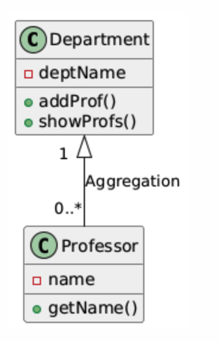

# Aggregation in C++ and UML Notation

Aggregation is a specialized form of association in object-oriented programming where one class contains or owns objects of another class, but the objects it owns can exist independently. In simpler terms, it describes a "has-a" relationship, where one class is made up of other classes, but those classes can also exist without the parent class.

Aggregation reflects a whole-part relationship where the "part" (the contained object) can exist without the "whole" (the containing object).

---

## Key Points of Aggregation:

- **Weak Ownership**: The objects in the aggregation can exist independently of the parent object. For example, a Department may contain Professors, but the Professors can exist without the Department.
- **Lifetime**: The lifetime of the parts (the contained objects) is not dependent on the lifetime of the whole (the container).
- **"Has-a" Relationship**: Aggregation describes a relationship where one class "has" objects of another class.

---

## UML Notation for Aggregation

In UML, aggregation is represented by a hollow diamond at the end of the line connecting the "whole" class (the container) to the "part" class (the contained objects). The diamond is placed at the end of the class that contains the other.

---

### Example: UML Diagram for Department and Professor (Aggregation)

In this example:

- A Department can have many Professors.
- A Professor can exist independently of the Department.


### UML Explanation:

- The hollow diamond on the side of the Department class indicates that Department aggregates Professors. This means that a Department contains Professors, but the Professors can exist even without the Department.
- The multiplicity `1` on the Department side indicates that each Professor is part of at most one Department.
- The multiplicity `0..*` on the Professor side means that a Department can have zero or more Professors.

---

## Example of Aggregation in C++

Let’s implement aggregation where a Department aggregates multiple Professors.

```cpp
#include <iostream>
#include <string>
#include <vector>
using namespace std;

class Professor {
private:
    string name;
public:
    Professor(string n) : name(n) {}

    string getName() {
        return name;
    }
};

class Department {
private:
    string deptName;
    vector<Professor*> professors;  // Aggregation of professors
public:
    Department(string name) : deptName(name) {}

    // Add professor to the department
    void addProfessor(Professor* prof) {
        professors.push_back(prof);
    }

    // Display all professors in the department
    void showProfessors() {
        cout << "Professors in " << deptName << " department:" << endl;
        for (auto prof : professors) {
            cout << prof->getName() << endl;
        }
    }
};

int main() {
    Professor prof1("Dr. Smith");
    Professor prof2("Dr. Johnson");

    Department dept("Computer Science");

    dept.addProfessor(&prof1);  // Aggregating professors
    dept.addProfessor(&prof2);

    dept.showProfessors();  // Output the list of professors

    return 0;
}
```

---

## Code Explanation:

### Aggregation Relationship:

- The `Department` class contains a collection of `Professor` objects. However, these professors are not destroyed if the Department is destroyed.
- The `Professor` objects can live independently of the `Department`. For example, the `Professor` objects (`prof1` and `prof2`) are created outside the `Department` and simply referenced by the `Department`.

### Method `addProfessor()`:

- This method aggregates `Professor` objects into the `Department`. The `Department` doesn’t own the `Professor` objects (since they are created outside and passed by pointer).

### Display Method:

- The `showProfessors()` method loops through the aggregated `Professor` objects and prints their names, demonstrating the weak ownership between the `Department` and `Professor` objects.
