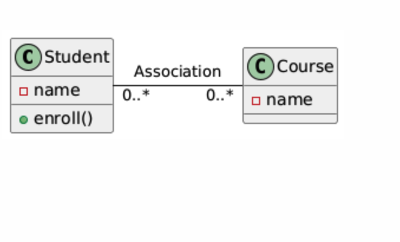

# Association in C++ and UML Notation

Association in object-oriented programming represents a relationship between two classes where the objects of one class can be connected or related to objects of another class. In association, there is no ownership involved between the objects, meaning that the objects are independent of each other, yet they interact.

## Key Points:
- **Multiplicity**: Association indicates how many objects of one class can be associated with objects of another class. For example, a student can be enrolled in many courses, and each course can have many students. This is represented using multiplicity symbols (1, 0..1, *, 0..*).
- **Direction**: In unidirectional association, one class knows about the other, but not vice versa. In bidirectional association, both classes know about each other.
- **No Ownership**: In a simple association, neither class owns the other, and their lifetimes are independent.

## UML Notation for Association

In UML (Unified Modeling Language), an association is represented by a straight line connecting two classes. You can also specify the multiplicity of the relationship and its direction.

### UML Representation of Association
- **Multiplicity**: Indicates how many objects of one class can be associated with objects of the other class.
  - `1`: Exactly one.
  - `0..1`: Zero or one.
  - `* or 0..*`: Zero or more (many).
  - `1..*`: One or more.
- **Directionality**: An arrowhead can indicate unidirectional association. If no arrowhead is present, the association is considered bidirectional.

### Example: UML Diagram for Student and Course (Association)
Here is how the UML diagram for an association between a Student and a Course would look. In this example:

- A Student can enroll in many Courses.
- A Course can have many Students.




#### UML Explanation:
- The association between Student and Course is represented by a straight line connecting the two classes.
- The multiplicity `0..*` on both ends means that a student can be enrolled in many courses, and a course can have many students (many-to-many relationship).
- This association is bidirectional, meaning both the Student class and the Course class know about each other.

## Example in C++:
```cpp
#include <iostream>
#include <string>
using namespace std;

class Course {
private:
    string courseName;
public:
    Course(string name) : courseName(name) {}

    string getCourseName() {
        return courseName;
    }
};

class Student {
private:
    string studentName;
public:
    Student(string name) : studentName(name) {}

    void enrollInCourse(Course &course) {
        cout << studentName << " is enrolled in " << course.getCourseName() << endl;
    }
};

int main() {
    Course course1("Mathematics");
    Student student1("John");

    student1.enrollInCourse(course1);  // John is enrolled in Mathematics

    return 0;
}
```

### Code Explanation:
- **Bidirectional Association**: The Student can access information about a Course through the `enrollInCourse()` function, but neither Student nor Course objects own each other.
- The objects (student1 and course1) are independent of each other in terms of lifetime.

## Conclusion

In UML, association is represented as a simple connection between two classes with an optional arrow to indicate directionality and multiplicity to show the cardinality of the relationship. In C++, associations are implemented as relationships between objects where one object can reference another, but their lifetimes are independent.
