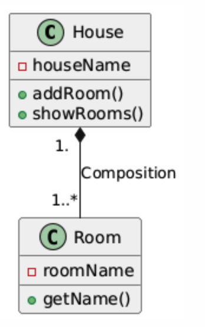

# Composition in C++ and UML Notation

Composition is a stronger form of association in object-oriented programming. It represents a relationship where one class owns objects of another class, and the objects being owned cannot exist independently of the owner. Composition is often referred to as a "part-of" relationship.

In composition, the lifetime of the contained objects (parts) is tied to the lifetime of the container object (whole). If the container object is destroyed, all its parts are also destroyed automatically.

---

## Key Points of Composition:

- **Strong Ownership**: The container class owns the contained objects, meaning the parts cannot exist without the whole.
- **Lifetime Dependency**: The lifetime of the contained objects depends on the lifetime of the container. When the container is destroyed, the parts are destroyed as well.
- **"Part-of" Relationship**: Composition describes a relationship where the contained objects are an integral part of the container.

---

## UML Notation for Composition

In UML, composition is represented by a filled diamond at the end of the line connecting the container (whole) class to the contained (part) class. The filled diamond indicates that the container fully owns the parts, and when the container is destroyed, the parts are also destroyed.

---

### Example: UML Diagram for House and Room (Composition)

In this example:

- A House can have multiple Rooms.
- The Room objects cannot exist independently of the House. If the House is destroyed, the Rooms are also destroyed.



### UML Explanation:

- The filled diamond on the House side indicates that the House owns the Room objects, and they cannot exist without the House.
- The multiplicity `1` on the House side means that each Room is part of exactly one House.
- The multiplicity `1..*` on the Room side means that a House can have one or more Rooms.

---

## Example of Composition in C++

Let’s implement composition where a House contains multiple Rooms. When the House is destroyed, the Rooms are also destroyed.

```cpp
#include <iostream>
#include <string>
#include <vector>
using namespace std;

class Room {
private:
    string roomName;
public:
    Room(string name) : roomName(name) {}

    string getRoomName() {
        return roomName;
    }
};

class House {
private:
    string houseName;
    vector<Room*> rooms;  // Composition of rooms
public:
    House(string name) : houseName(name) {}

    // Destructor to clean up dynamically allocated rooms
    ~House() {
        for (Room* room : rooms) {
            delete room;  // Destroy all rooms when the house is destroyed
        }
        cout << "House and its rooms are destroyed." << endl;
    }

    // Add room to the house
    void addRoom(string roomName) {
        rooms.push_back(new Room(roomName));  // Rooms are created and owned by House
    }

    // Display all rooms in the house
    void showRooms() {
        cout << "Rooms in " << houseName << " house:" << endl;
        for (Room* room : rooms) {
            cout << room->getRoomName() << endl;
        }
    }
};

int main() {
    House house("Luxury Villa");

    house.addRoom("Living Room");
    house.addRoom("Bedroom");

    house.showRooms();  // Output the list of rooms

    // House and its rooms are destroyed when house goes out of scope
    return 0;
}
```

---

## Code Explanation:

### Composition Relationship:

- The `House` class is composed of multiple `Room` objects, and the `House` owns the `Room` objects. This means the `Room` objects cannot exist independently of the `House`.
- When the `House` is destroyed (i.e., goes out of scope), all the `Room` objects are also destroyed because they are dynamically allocated and deallocated in the `House` class.

### Destructor in Composition:

- The destructor `~House()` ensures that when the `House` is destroyed, all the dynamically allocated `Room` objects are properly cleaned up (`delete room;`).

### Method `addRoom()`:

- This method creates `Room` objects dynamically and stores them inside the `House`. The rooms are fully owned by the `House` class.

### Lifetime Dependency:

- The `Room` objects do not exist outside the context of the `House`. Once the `House` object goes out of scope, the `Room` objects are also destroyed.

---

## Composition vs. Aggregation

While both composition and aggregation are types of associations, composition represents a much stronger relationship in terms of ownership and lifetime dependency.

| Concept       | Description | Ownership    | Lifetime                          |
|---------------|-------------|--------------|-----------------------------------|
| Aggregation   | "Has-a" relationship where one class contains objects of another class, but they exist independently. | Weak ownership | Contained objects live independently. |
| Composition   | "Part-of" relationship where one class contains objects that cannot exist without the container. | Strong ownership | Contained objects are destroyed with the owner. |
