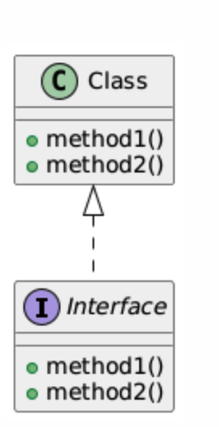

# Realization in Object-Oriented Programming (OOP) and UML

Realization is a relationship between classes in object-oriented programming (OOP) and is commonly depicted in Unified Modeling Language (UML). It represents a connection between an interface and the class (or classes) that implement the interface.

The realization relationship can be viewed as a "contract" that the class promises to fulfill. The interface defines methods (or functionalities) without providing implementations, while the class that realizes the interface provides concrete implementations of those methods.

## Key Concepts of Realization:

### Interface:
An interface defines a set of methods that a class must implement. It does not provide any method implementations itself.

### Class that Realizes the Interface:
A class that realizes an interface must provide concrete implementations for all methods defined in the interface.

### UML Representation:
In UML diagrams, realization is represented using a dashed line with an empty arrowhead pointing from the class to the interface. The arrow indicates that the class realizes (implements) the interface.

## UML Notation for Realization:
In UML, realization is shown as a dashed line with an open triangle pointing towards the interface, like this:




## Example: Realization in C++ (Interface and Class)

In C++, interfaces are usually represented by pure virtual classes, meaning a class with one or more pure virtual functions. A class that inherits from an interface (abstract class) must implement all the pure virtual functions.

### Example Code:
```cpp
#include <iostream>
using namespace std;

// Interface (pure virtual class)
class Shape {
public:
    // Pure virtual functions
    virtual void draw() const = 0;
    virtual double area() const = 0;
};

// Class that realizes the interface
class Circle : public Shape {
private:
    double radius;
public:
    Circle(double r) : radius(r) {}

    // Implementing the interface methods
    void draw() const override {
        cout << "Drawing a circle" << endl;
    }

    double area() const override {
        return 3.14 * radius * radius;
    }
};

int main() {
    Circle c(5);
    c.draw();  // Calls Circle's implementation of draw()
    cout << "Area: " << c.area() << endl;

    return 0;
}
```

## Explanation:
### Interface (Shape):
- The `Shape` class represents an interface. It defines two pure virtual functions (`draw()` and `area()`), which means that it is abstract and cannot be instantiated.

### Realizing the Interface (Circle):
- The `Circle` class inherits from `Shape` and realizes the interface by providing concrete implementations of the `draw()` and `area()` functions.

### UML:
- In a UML diagram, `Circle` would be connected to `Shape` via a realization relationship, indicating that `Circle` fulfills the contract defined by the `Shape` interface.

## Polymorphism in C++

Polymorphism is one of the core principles of object-oriented programming (OOP). It allows objects of different classes to be treated as objects of a common base class, enabling a single function or method to work on different types of objects.

There are two types of polymorphism in C++:
1. **Compile-time (Static) Polymorphism**: Achieved through function overloading and operator overloading.
2. **Run-time (Dynamic) Polymorphism**: Achieved through inheritance and virtual functions.

### 1. Compile-time (Static) Polymorphism
In compile-time polymorphism, the function to be called is resolved at compile time. This is done using function overloading and operator overloading.

#### Example: Function Overloading
```cpp
#include <iostream>
using namespace std;

class Math {
public:
    // Overloaded functions with different signatures
    int add(int a, int b) {
        return a + b;
    }

    double add(double a, double b) {
        return a + b;
    }
};

int main() {
    Math math;
    cout << "Add integers: " << math.add(3, 5) << endl;    // Calls add(int, int)
    cout << "Add doubles: " << math.add(2.5, 3.5) << endl; // Calls add(double, double)
    return 0;
}
```

### Explanation:
The `Math` class has two `add()` functions with different parameter types. The compiler decides which version to call based on the types of arguments passed. This is resolved at compile time, making it static polymorphism.

### 2. Run-time (Dynamic) Polymorphism
In dynamic polymorphism, the function to be called is determined at run-time based on the type of object being referenced, not the type of the pointer or reference. This is achieved using virtual functions and inheritance.

#### Example: Virtual Functions and Dynamic Polymorphism
```cpp
#include <iostream>
using namespace std;

// Base class
class Animal {
public:
    // Virtual function for dynamic binding
    virtual void speak() const {
        cout << "Animal makes a sound." << endl;
    }
};

// Derived class 1
class Dog : public Animal {
public:
    void speak() const override {
        cout << "Dog barks." << endl;
    }
};

// Derived class 2
class Cat : public Animal {
public:
    void speak() const override {
        cout << "Cat meows." << endl;
    }
};

int main() {
    Animal* animalPtr;  // Base class pointer

    Dog dog;
    Cat cat;

    animalPtr = &dog;
    animalPtr->speak();  // Output: Dog barks (dynamic binding)

    animalPtr = &cat;
    animalPtr->speak();  // Output: Cat meows (dynamic binding)

    return 0;
}
```

### Explanation:
#### Virtual Function (`speak()`):
- In the base class `Animal`, `speak()` is declared as a virtual function. This allows derived classes (`Dog` and `Cat`) to override it with their own implementations.

#### Dynamic Binding:
- At runtime, when `animalPtr->speak()` is called, the version of `speak()` in the actual object (either `Dog` or `Cat`) is invoked, even though the pointer is of type `Animal*`. This is dynamic polymorphism because the function call is resolved at run-time based on the object type.

## UML Representation of Polymorphism:
In UML, polymorphism is depicted using inheritance, with the base class connected to its derived classes through a generalization (solid line with an open arrow).

## Differences Between Realization and Polymorphism

| Concept       | Realization                                                | Polymorphism                                                |
|---------------|-------------------------------------------------------------|-------------------------------------------------------------|
| Definition    | Realization is a relationship where a class provides the concrete implementation for an interface. | Polymorphism allows one interface to be used for multiple types of objects, enabling dynamic behavior. |
| Purpose       | Realization defines what a class must implement.            | Polymorphism enables objects to be treated as instances of their base class, allowing dynamic behavior. |
| Method Binding| Realization involves binding methods at compile time (interfaces must be implemented by the class). | In dynamic polymorphism, methods are bound at run-time based on the actual type of the object. |
| UML Notation  | Represented by a dashed line with an empty arrowhead pointing from the class to the interface. | Represented by solid lines showing inheritance or implementation from a base class to derived classes. |
